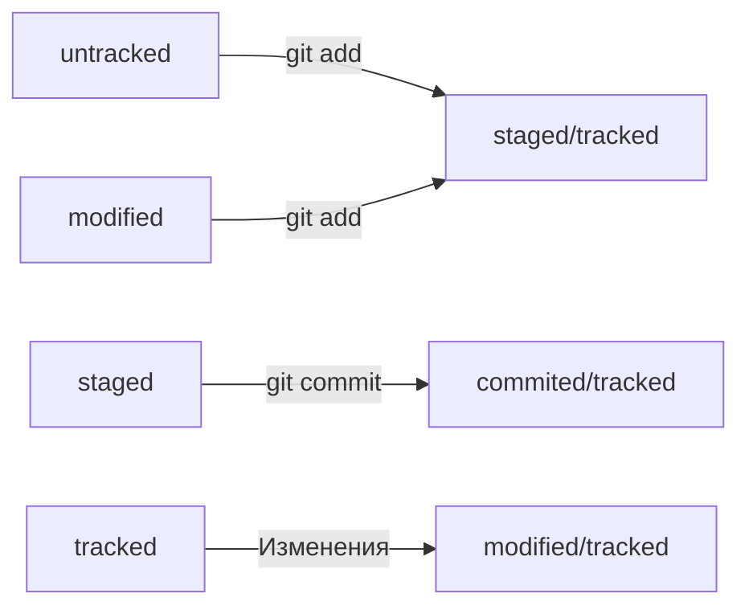

# Команды для GIT
## Синхронизация локального и удалённого репозиториев
---
```
git remote add origin https://github.com/#Имя пользователя#/#имя проекта#.git
```

Проверить что репозитории связались.
```
git remote -v
```


Первичная загрузка всех коммитов из локального репозитория в удалённый с именем **origin**
```
git push -u origin main
```


Загрузить коммиты в удалённый репозиторий после того , как он был привязан флагом -u
```
git push
```

## Клонирование репозитория
Склонировать репозиторий с URL **the-great-project.git** из аккаунта **TheGreatOwner** на локальный компьютер.
```
git clone git@github.com:TheGreatOwner/the-great-project.git
```

## Генерация SSH-ключей
* Прежде чем генерировать новую пару ключей, следует убедиться, что они отсутствуют на компьютере. Проверить это можно командой 
```
ls -la .ssh/
``` 
в домашней директории. Если ключи отсутствуют, создать их можно командой 
```
ssh-keygen
``` 
в директории ~/.ssh. 
После генерации ключ нужно привязать к GitHub.
## Заголовки, абзацы и перенос
---
Заголовки разных уровней создают решётками.

```
# H1 — заголовок первого уровня, самый большой
## H2 — заголовок второго уровня, поменьше
### H3
#### H4
##### H5
###### H6 — заголовок шестого уровня, самый маленький
```

## Хэш - идентификатор коммита
---
**Хеширование** (от англ. hash, «рубить», «крошить», «мешанина») — это способ преобразовать набор данных и получить их «отпечаток» (англ. fingerprint).  
Информация о коммите — это набор данных: когда был сделан коммит, содержимое файлов в репозитории на момент коммита и ссылка на предыдущий, или родительский (англ. parent), коммит. Git хеширует (преобразует) эту информацию с помощью алгоритма SHA-1 (от англ. Secure Hash Algorithm — «безопасный алгоритм хеширования») и получает для каждого коммита свой 
уникальный хеш — результат хеширования.  
Все хеши и таблицу хеш → информация о коммите **Git** сохраняет в служебные файлы. Они находятся в скрытой папке **.git** в репозитории проекта.

## GIT Log
---
После вызова **git log** появляется список коммитов с их описанием.  
1. Строка из цифр и латинских букв после слова commit — это уже знакомый вам хеш коммита.
2. Author — имя автора и его электронная почта.
3. Date — дата и время создания коммита.
4. Сообщение к коммиту.  

Сокращённый лог вызывают командой **git log** с флагом **--oneline** (англ. «одной строкой»). При этом в терминале появятся только первые несколько символов хеша каждого коммита и комментарии к ним.

## HEAD
---
При вызове команды **git log** можно заметить надпись **(HEAD -> master)** после хеша одного из коммитов.  
Файл **HEAD** (англ. «голова», «головной») — один из служебных файлов папки **.git**. Он указывает на коммит, который сделан последним (то есть на самый новый).  
Внутри **HEAD** — ссылка на служебный файл: **refs/heads/master** (или refs/heads/main в зависимости от названия ветки). Если заглянуть в этот файл, можно увидеть хеш последнего коммита.  
Если нужно передать последний коммит, то вместо его хеша можно просто написать слово **HEAD** — Git поймёт, что вы имели в виду последний коммит.

## Статусы GIT
---
### Основные статусы:
- Untracked  
Новые файлы в репозитории. Нет предыдущих версий, зафиксированных через **git add**
- Staged  
После выполения **git add** файл попадает в *staging area*, то есть в список файлов, которые войдут в коммит. 
- Tracked  
Противоположность *untracked*. Файлы которые были зафиксированы **git commit**, а также файлы, которые были добавлены **git add**
- Modified  
Git сравнил содержимое файла с последней версией и нашёл отличия.

### Жизненный цикл файла в Git
1. Файл только что создали. Git ещё не отслеживает его содержимое. Состояние: untracked.
2. Файл добавили в staging area с помощью git add. Состояние: staged (+ tracked).
   - Возможно, изменили файл ещё раз. Состояния: staged, modified (+ tracked). Обратите внимание: staged и modified у одного файла, но у разных его версий.  
   - Ещё раз выполнили git add. Состояние: staged (+ tracked).
3. Сделали коммит с помощью git commit. Состояние: tracked.
4. Изменили файл. Состояние: modified (+ tracked).
5. Снова добавили в staging area с помощью git add. Состояния: staged (+ tracked).
6. Сделали коммит. Состояния: tracked.
7. Повторили пункты 4−7 много-много раз.

### Схема изменения статусов

